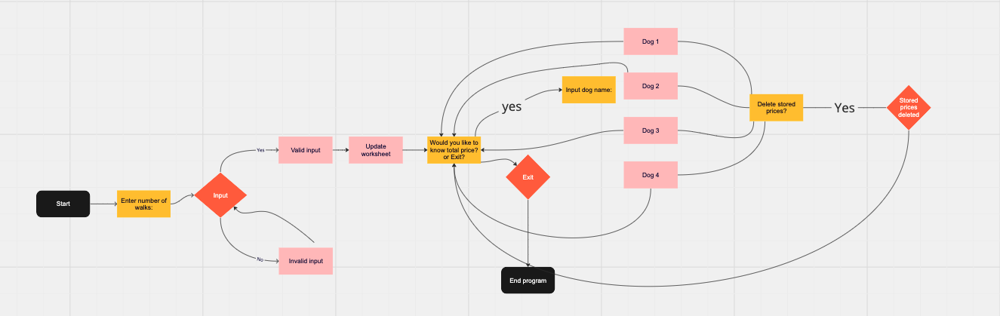
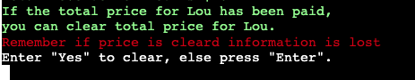
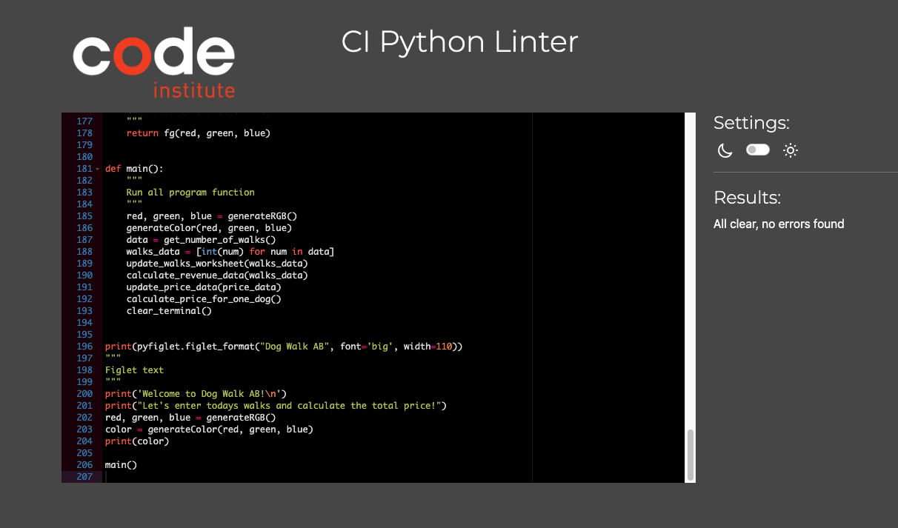
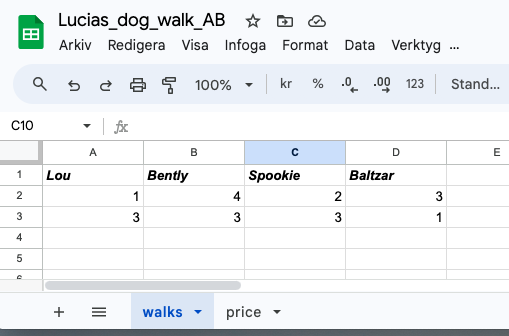
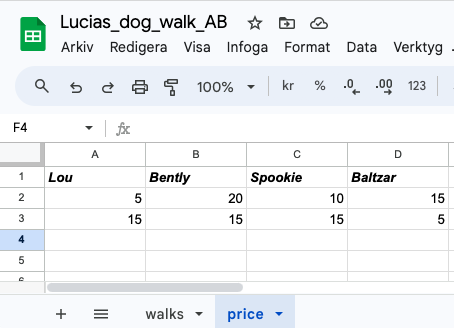

# Dog Walk AB

Dog Walk AB is a personalized program for dog walking companies. This program will help users to store information of walks and prices. 

[Click to view deployed project](https://dog-walk-ab-b6fc65e542c7.herokuapp.com/)

[Click to view project worksheet](https://docs.google.com/spreadsheets/d/1-z2f1tkFrZtLMJW0q38bZneJiyy5Eo5amcbG16H9BkQ/edit#gid=1820810552)

## User Experience 

This program runs inside a mock terminal. This limited the abillity to create a creative frontend for the user. To create some user friendly features styling has been added to the text inside the terminal. The text will change color each time the program runs. Darker text will not be used since this would create a bad user experience. Importent text content is highlighted with red color. 

A pyfiglet text with Dog Walk AB logo welcomes the user each time the program is started. There were several fonts to choose from for the logo. Ultimately the font that were choosen suited the terminal without taking up to much space or being to distractive.

There are several inputs needed by the user. To make it as easy as possible for the user, informative text will explain what inputs are needed. If the input is invalid, it will be explained to the user and also what input the program expects. The information can seem a bit repetitive, but this is to minimize confusion for user so he/she understands what kind of inputs the program are looking for.

## User Stories

It's important that the program:
- Explains its purpose
- Explines functionality
- Has easy and informative instructions
- Helps the user if inputs are invalid
- Inputs don't have to be capitalized in order to work
- Is easy to exit 

## How to use
To use the program, simply follow the instructions provided. Enter number of walks in presented order. Then if the user would like to see the total cost for a dog, enter name of the dog and the total price will be fetched! If the user would like to delete the total price, the program provides this service.This would be incase the total price has been paid off, and the user would like to reset the total price. When the user wants to leave the program he/she enters the word "Exit" and the program will read "Thank you for today!", and then exits.

## Flowchart 
In plaing of this program a simple flowchart was created with website Miro. This helped to create the basic structure of how the functions would work depending on user input. 

https://miro.com/

  
Miro flowchart

  

*** 
## Features

### Existing Features
- Welcome text

The user is welcomed with a Pyfiglet styled text. This text displays the Dog Walk AB logo. This gives the otherwise bland terminal a fun decor.
The Welcome text provides the user with information on how to enter number of walks. If the user enters invalid information there will be a error message. Then the user will be asked to insert new values until the values are correct.

  
Welcome text picture

  

  
Enter number of walks picture

  

- Updating worksheet

When user has enterd number of walks the information will be stored inside a worksheet called walks. By default the user will be informed of the daily revenue. The daily revenue will be stored in worksheet called prices.

- Total price display

 From the price worksheet, the user will be abel to extrect information of the total price for each dog. The user can also choose to delete price column for each dog. The user is presented with the option and also warned that if price information is deleted it is lost. This warning is presented in red text to highlight the result from deleting price information. If user chooses not to delete information he/she is informed to simply press enter. This will lead the user back to the "get total price" question. 

  
Enter number of walks picture

  

- Deleteing price columns

If the user would like to clear to prices inside the worksheet, he/she can do this by entering name of dog that should be cleared and then enter "Yes" when prgram asks if user wants to delete total price.

  
Delete price picture

  

- Exit program

When the user is ready to leave the program, he/she enters exit in the input. Before the program exits there is a print message reading "Thank you for today!" The program will then clear the terminal automatically after 3 second. 

  
Exit program picture

  

- Color terminal

To make the program user friendly there is a color function that will randomly change the color of the text in the terminal. This is to make the program funnier to use.

### Future Features
- This app should in the future have the abillity to add a new dog to the program
- More styling should be added to text
- Prices should be adjustable, having different prices for different dogs, depending on maintenance.

*** 
## Data Model
The walks and price information is stored in a Googel spread sheet. The worksheet contains two sheets, "walks" and "price". Inside the "walks" sheet information enterd by user is stored. This information is then used to calculate the price, and then store price information inside the "price" sheet.
When information is imported from the worksheet, it reads as a List by dafault. To be abel to calculate walks and price information the List items are turned into integers instead of strings.

## Testing
### Following tests were carried out:
- User inputs will be handled, if input value is incorrect this    
  will be handled with information of error.
- Walks worksheet updates with the right number of walks
- Each dog name collects correct value from price 
- Daily revanue calculates correctly and stores in price worksheet
- The delete attribute deletes correct column.
- Exit function will close the program

### Bugs

- Colord text

The color text function will stop working after red highlight is enterd. Since this is not part of the colord text function it will break. This leads to the rest of the text enterd after highlight will go back to default color. This could be fixed by reentering color function after highlighted statement. Since this happens when the program is close to finishing the problem of this bug is minimal. When the program restarts the color function runs as it should.

Status: Under investigation.

### Solved Bugs
- Problem with deployment to Heroku.

    When trying to deploy project  
    error message occured. This was because the import of gspread was never installed in the terminal.
    Status: Fixed.

- Clear price columns

    There was a bug in the program that results in error message. This would occure when user clears price worksheet. The columns clears as they should, but when the user would like to get the total revenue the program broke. This bug was belived to have to do with the cleared columns. When the calculate_prices function tried to calculate the total price, the empty cells were read as strings. Which are not allowed inside the calculate function.
    This problem was fixed with help from chatGPT, by adding code to tell the program to read empty cells as a digits.
    
    Status: Fixed.

### Validator Testing
- PEP8 https://pep8ci.herokuapp.com/
  - Validation showed minor errors of whitespces. Theese errors were corrected. No errors left in program.

  
CI Python Linter picture

  

***

## Libraries and Technologies
### Libraries used:

- gspread- was used to handle Google Sheets API by Python

[Click to view project worksheet](https://docs.google.com/spreadsheets/d/1-z2f1tkFrZtLMJW0q38bZneJiyy5Eo5amcbG16H9BkQ/edit#gid=1820810552)

  
Worksheet "walks" picture

  

  
Worksheet "price" picture

  

- pyfiglet- was used to write Dog Walk logo
- os- was used to be able to clear the terminal
- time- was used to set a timefunction to clear the terminal.
- random- was used to be abel to randomize color change in terminal
- sty- was imported to style text in terminal
-pprint- was used to check functions
### Software
- GitHub
- Heroku
- Codeanywhere
- Googel
- Youtube
- ChatGPT
- Miro

## Deployment
### To deploy project in Heroku

- Create a Heroku account.
- Log in to Heroku account.
- In the dashbord choose "Create new app". It's located in the 
  middel of the dashboard.
- Give the new app a name and choose what region you are from. 
- When information is enterd, find the tabs to Overview, Resources, Deploy, Metrics, Activity, Access and Settings. This should be in the upper right of the site. Click "Settings" tab.
- Find the Config Vars section and click the "Reveal Config Vars".
Enter information if there is hidden information in GitHub  repository. In this project a creds.json file was enterd. If you don't have any hidden information in GitHub, step over the two following sections.
- Inside Create config vars, enter KEYS and VALUE. Inside KEYS enter CREDS and copy and paste information from creds.json file, into VALUE. Click the "Add" button. 
- Add a new KEY with PORT and VALUE 8000. Click "Add" button.
- Scroll down to Buildpacks section. Click "Add buildpack". 
- Choose buildpack Python and "Save changes". Add another buldpack with nodjs. Save changes. It is importent that the buildpacks are added in the correct order. Drag and drop buildpacks if they are in the wrong order.
- When buildpacks are in order. Locate the "Deploy" tab. It's found on the leftside of "Settings" tab.
- In the Deployment method section, choose GitHub to connect repository. Confirm request to connect GitHub.
-Search for repo-name. This is the name of repository. Click "Search". 
-Click "Connect" to link Heroku app to GitHub repository.
-Scroll down to Automatic deploy section and Manual deploy section.
-Choose how project should be deployed. If Enable Automatic Deploys, Heroku rebuilds app every time new changes are pushed.
- If Manual deploy is choosen the current state of the project will be deployed. For this alternative click "Deploy Branch".
- When project is deployed there will be four green circles with checkmarks inside. There should be a message "Yor app was successfully deployed.". Click the "View" button to se deployed project. If steps are followed there should be a mock terminal with project inside of it. Program starts automaticly. 

### To deploy project in GitHub
Note, this program uses Heroku to function. This means that deployment can not function if only GitHub is used. Follow steps described inside "To deploy project in Heroku". 
1. First, navigate to the Settings tab
2. In the dropdown menu scroll down to Pages
3. Inside the Pages tab choose Source, Deploy from branch
4. Under the branch enter main and /(root)
5. Enter save
6. When the site has been deployed a Manilla folder will show up with a red ribbon
***
## Credits

#### Code Institute
- Tutoring sessions with Code Institute
- My fantastic mentor Brian O'Hare
- Class mentor David Calikes who helped me getting trough this project
- Love Sandwiches project

#### ChatGPT
ChatGPT was used to explain python language. ChatGPT helped with explaining while loop, functions and try-except statements. ChatGPT was used to fix bug that made deleted cells into strings. ChatGPT provided code that helped fix this bug. The code provided will tell the computer to read empty cells as digits. 

#### Over all credits:
- W3schools 
    Was used to find information about Python language.
- gspred
    Was used to find information on how to use gspread and access information in worksheet.

- GitHub user gStarhigh
    To create this README I was inspired by the exellent README from gStarhighs project project 3- Python. A budget app.

-  Youtube tutorial
    Learn Python Functions - Quick Python Project For Beginners by Python Simplified.
