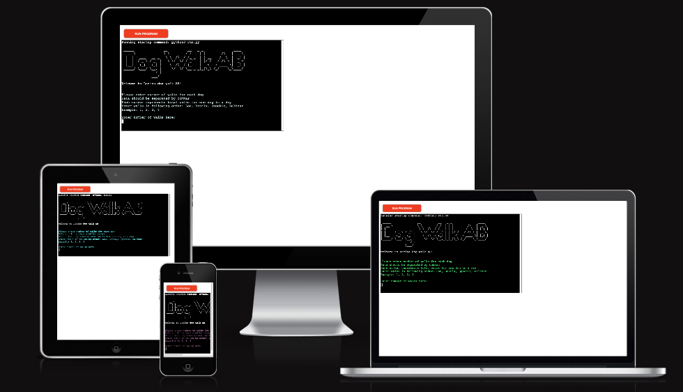

# Dog Walk AB
***
Dog Walk AB is a personalized program for dog walking companies. This program will help user to keep trac of number of walks in a day for each dog. This program will also calculate the total price for each dog, by simply typing in the name of the dog.

- Link to deployed project:
https://dog-walk-ab-b6fc65e542c7.herokuapp.com/

- Link to Google spreadsheet:
https://docs.google.com/spreadsheets/d/1-z2f1tkFrZtLMJW0q38bZneJiyy5Eo5amcbG16H9BkQ/edit#gid=1820810552

## How to use
To use the program, simply follow the instructions provided. Enter number of walks in presented order. Then if the user would like to see the total cost for a dog, enter name of the dog and the total price will be fetched! If the user would like to leave the  it is really simple. Just write exit and the program will finish and the reminal will clear it self.
*** 
## Features
*** 
### Existing Features
- Welcome text
The user is welcomed with a Pyfiglet styled text. This text displays the Dog Walk AB logo. This gives the otherwise bland terminal a fun decor.
The Welcome text provides the user with information on how to enter number of walks. If the user enters invalid information there will be a error message. Then the user will be asked to insert new values until the values are correct.

- Updating worksheet
When user has enterd number of walks the information will be stored inside a worksheet called walks. By default the user will be informed of the daily revanue. The daily revanue will be stored in worksheet called prices. From this worksheet the user will be abel to extrect information of the total price for each dog.

- Exit program
When the user is ready to leave the program, he/she enters exit in the input. The program will then clear the terminal automatically after 5 second.

- Color terminal
To make the program user friendly there is a color function that will randomly change the color of the text in the terminal. This is to make the program funnier to use.
### Future Features
- This app should in the future have the abillity to add a new dog to the program.
- There will be a delete function for the user to delete price for each dog when the price has been paid.
*** 
## Data Model
***
## Testing
### Bugs
#### Solved Bugs
#### Remaining Bugs
### Validator Testing
- PEP8 https://pep8ci.herokuapp.com/
  - Validation showed minor errors of whitespces. This errors were corrected. No effors left in program.

## Deployment
## Credits

